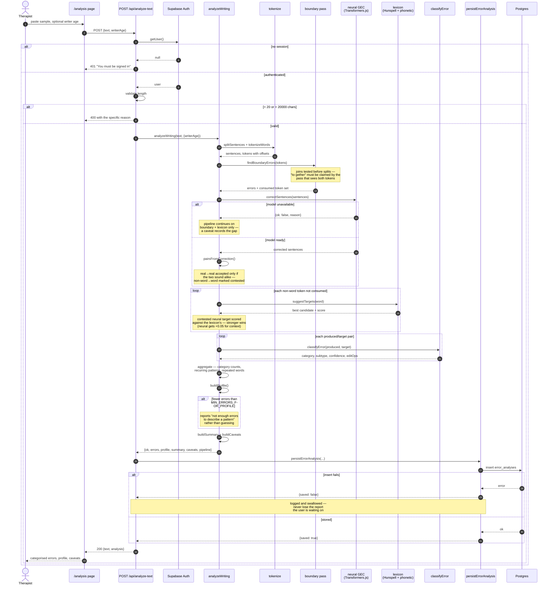
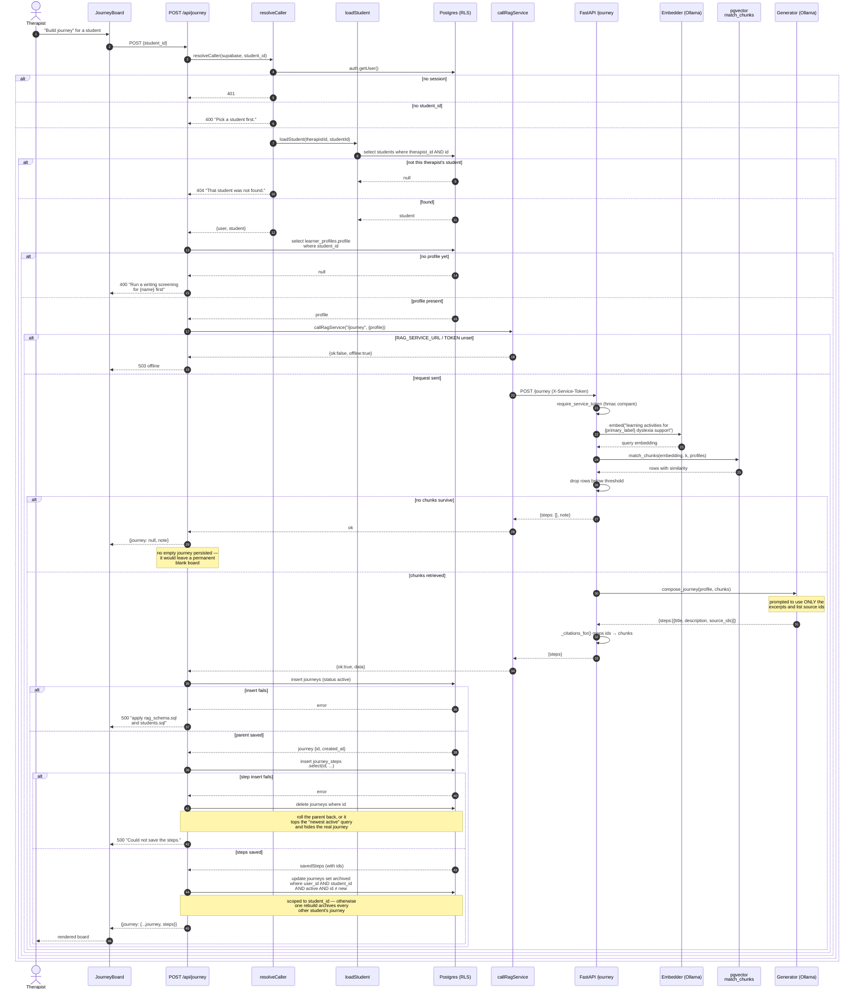
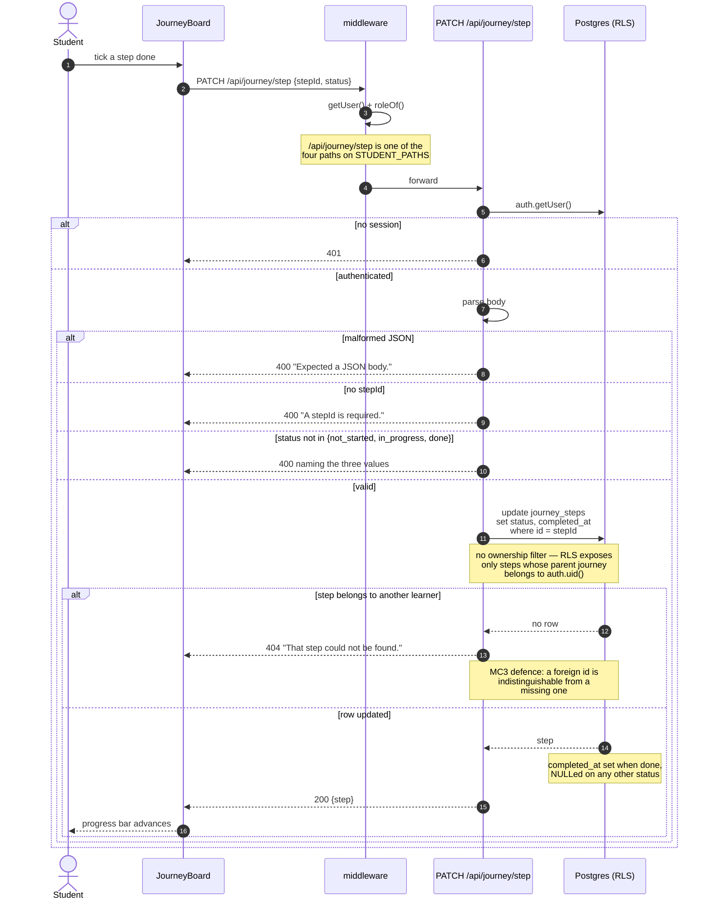
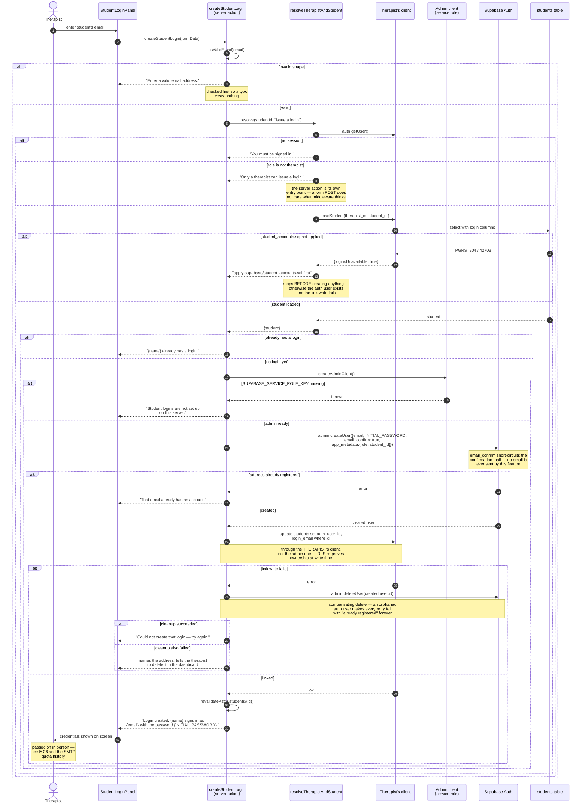
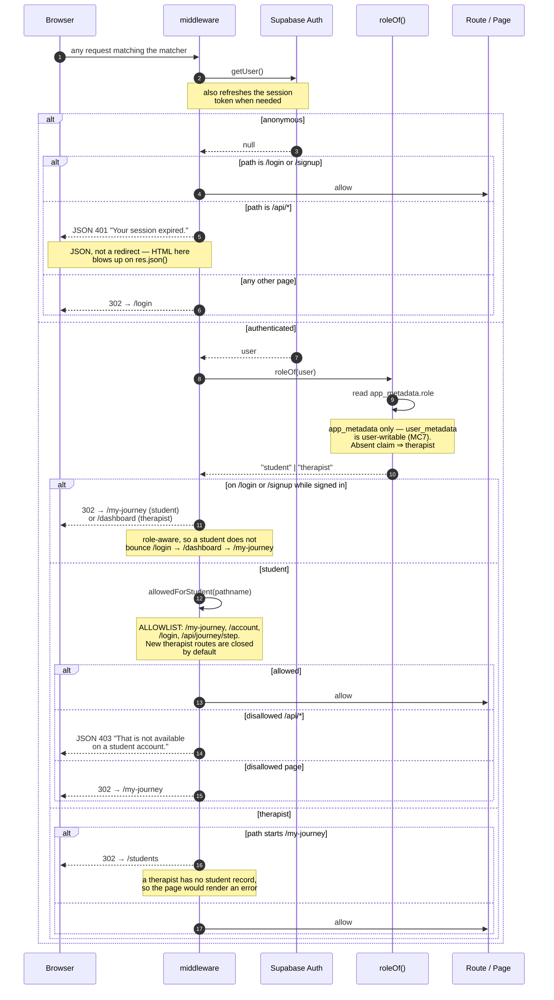

# Sequence Diagrams — DAS D.I.A.L. (Team 6)

**Written:** 2026-08-13 · **Branch:** `jer`

Five workflows that had no diagram in the Project Meeting 1/2 document. The four original
diagrams (Sign Up, Login, Prediction Service, Find and Download Material) are unchanged and
stay in that document.

Each diagram is drawn from the code as it is on this branch, not from intended design.
Failure branches are included because in this system they are where most of the interesting
behaviour lives — the rollbacks especially.

| # | Workflow | Use case | Entry point |
|---|---|---|---|
| SD5 | Error Pattern Analysis | UC14 | `app/api/analyze-text/route.js` |
| SD6 | Generate Learning Journey | UC15 | `app/api/journey/route.js:44` |
| SD7 | Student Completes a Step | UC20 | `app/api/journey/step/route.js` |
| SD8 | Issue Student Login | UC12 | `app/students/actions.js:101` |
| SD9 | Role-Based Access Enforcement | UC24 / MC1 | `middleware.js` |

---

## SD5 — Error Pattern Analysis (UC14, PS4)

The largest subsystem in the project, and the one with no prior diagram. Note that the
three detection passes are ordered deliberately: boundary claims tokens first, the neural
pass sees errors that produce real words, and the lexicon pass sweeps up what is left.

---

## SD6 — Generate Learning Journey (UC15)

Crosses the JS → Python boundary. The two rollback branches at the end are the reason this
diagram is worth drawing: both exist to stop a partial write from hiding a journey the
student already had.

**Measured latency** (Intel Iris Xe, CPU-only inference, recorded in `lib/ragService.js:14-18`):
`/journey` **76 s warm, 121.8 s cold**. The client timeout is 300 s by default and
overridable via `RAG_SERVICE_TIMEOUT_MS`; it was raised from 120 s after firing on a
request that had actually succeeded.

---

## SD7 — Student Completes a Step (UC20)

Short, and the point is what is *absent*: there is no ownership check in the handler. RLS
is the authorisation, and the 404 is a row that did not match.

---

## SD8 — Issue Student Login (UC12)

The compensating delete at the end is the whole reason this needs a diagram: two different
Supabase clients are used on purpose, and the failure between them leaves an orphan that
would otherwise block every retry forever.

---

## SD9 — Role-Based Access Enforcement (UC24 / MC1)

Runs on every request that is not a static asset. The API-versus-page split matters: a
redirect answering an API call sends an HTML login page to `res.json()`, which surfaces as
a parser error instead of the real reason.

All redirect URLs are built with `nextUrl.clone()`, so a forged `Host` header cannot send
the user to an attacker's origin — asserted in `middleware.test.js`.

---

## Consistency notes

- **SD6 and SD7 both rely on `journeys.user_id` holding the *therapist*.** That is why the
  student's read (`loadJourneyForStudent`) filters on `student_id` only: filtering on the
  signed-in student's uid would return `null` every time.
- **SD5 and SD6 write through different persistence contracts.** SD5 swallows a storage
  failure (the report is worth more than the record); SD6 rolls back (a partial journey
  actively hides a good one). Both are deliberate and neither should be "made consistent".
- **SD8 is the only flow that uses the service-role key**, and it hands the write back to
  the therapist's own client as soon as it can.
