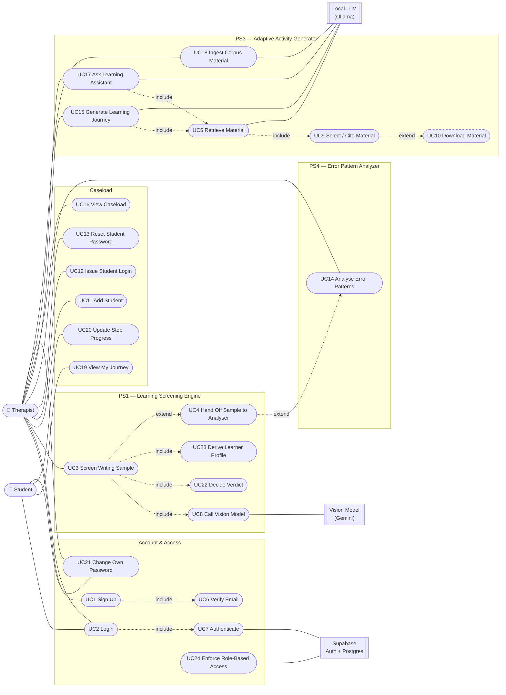
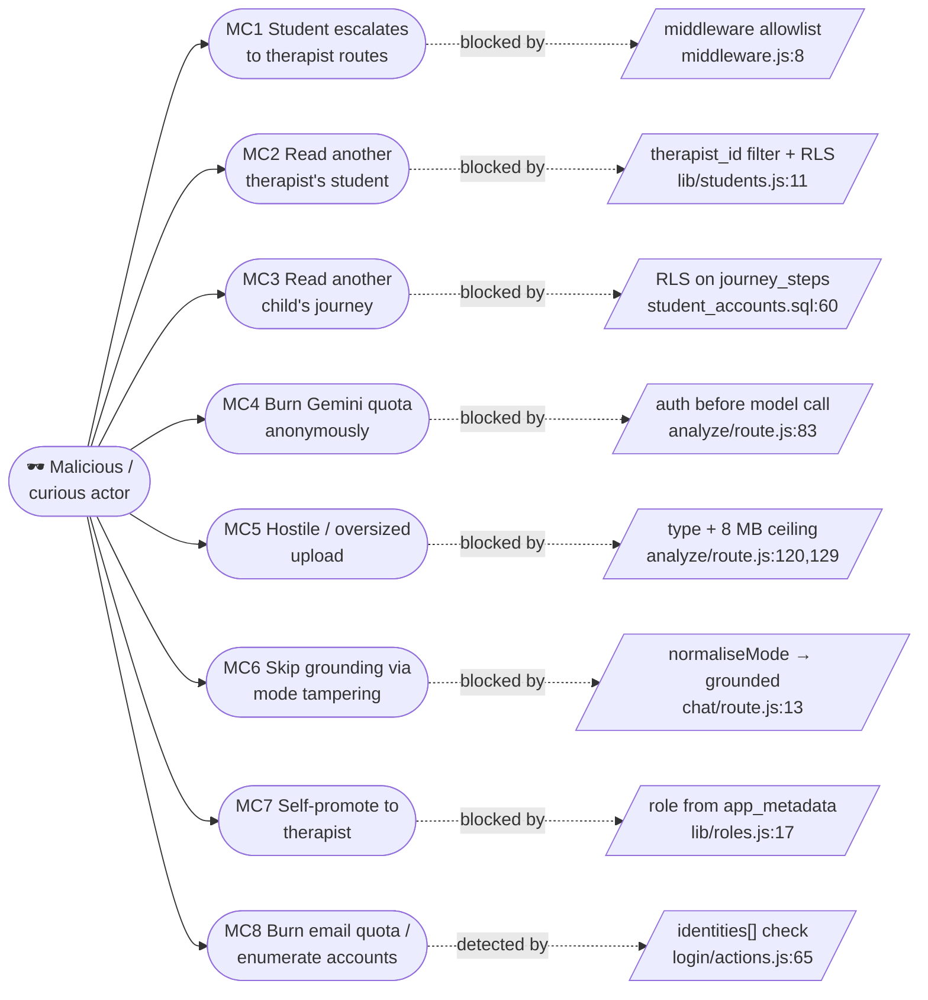

# Use Cases — DAS D.I.A.L. (Team 6)

**Written:** 2026-08-13 · **Branch:** `jer` · **Covers:** UC1–UC24 and MC1–MC8

Every use case below names the file that implements it. Nothing here is aspirational
unless the Status column says so. Line references were read on 2026-08-13.

UC1–UC10 are the set carried forward from the Project Meeting 1/2 document, kept at their
original numbers so the existing test filenames (`tests/unit/uc3-uc8-…`) and the earlier
report sections still line up. UC11 onward are new: they cover the student-account,
error-analysis and learning-journey work built since that document was written.

**UC4 was missing from the original document** — the tables jumped UC3 → UC5
(`tests/README.md:161`). It is filled here by the screener → analyser handoff, which is
the step that genuinely sits between them.

---

## Actors

| Actor | Who / what | Notes |
|---|---|---|
| **Therapist** | Educational therapist at DAS | The default role. An account with no `app_metadata.role` claim is a therapist (`lib/roles.js:16-20`) so every account created before student logins existed keeps working. |
| **Student** | The learner | Gets a login only when a therapist issues one. Reaches exactly four paths (`middleware.js:8`). |
| **Vision Model** | Google Gemini `gemini-3-flash-preview` | External. Extracts indicators from an uploaded image or PDF. |
| **Local LLM** | Ollama (embedding + generation) | External, self-hosted. Powers retrieval and journey/chat composition. |
| **Auth & Data Store** | Supabase (Auth + Postgres + pgvector) | External. Holds credentials, all rows, and the RLS policies. |

---

## Use case diagram

`UC10` is dashed because it is **not implemented** — see its entry below.

---

## Use case index

| # | Name | Actor | Implemented in | Status |
|---|---|---|---|---|
| UC1 | Sign Up | Therapist | `app/signup/page.jsx`, `app/login/actions.js:50` | ✅ |
| UC2 | Login | Therapist, Student | `app/login/actions.js:35` | ✅ |
| UC3 | Screen Writing Sample | Therapist | `app/api/analyze/route.js` | ✅ |
| UC4 | Hand Off Sample to Analyser | Therapist | `lib/screening/handoff.js` | ✅ (fills the gap) |
| UC5 | Retrieve Material | System | `rag-service/app/retrieval.py` | ✅ |
| UC6 | Verify Email | System | Supabase Auth | ✅ (external) |
| UC7 | Authenticate | System | `supabase.auth.signInWithPassword` | ✅ (external) |
| UC8 | Call Vision Model | System | `app/api/analyze/route.js:170` | ✅ |
| UC9 | Select / Cite Material | System | `rag-service/app/generation.py:50` | ✅ |
| UC10 | Download Material | Therapist | — | ❌ **not implemented** |
| UC11 | Add Student | Therapist | `app/students/actions.js:17` | ✅ |
| UC12 | Issue Student Login | Therapist | `app/students/actions.js:101` | ✅ |
| UC13 | Reset Student Password | Therapist | `app/students/actions.js:169` | ✅ |
| UC14 | Analyse Error Patterns | Therapist | `app/api/analyze-text/route.js`, `lib/nlp/analyze.js` | ✅ |
| UC15 | Generate Learning Journey | Therapist | `app/api/journey/route.js:44` | ✅ |
| UC16 | View Caseload | Therapist | `lib/students.js:63` | ✅ |
| UC17 | Ask Learning Assistant | Therapist | `app/api/chat/route.js` | ✅ |
| UC18 | Ingest Corpus Material | Therapist (operator) | `rag-service/app/main.py:47` | ✅ (no UI — HTTP only) |
| UC19 | View My Journey | Student | `app/my-journey/page.jsx`, `lib/journey.js:66` | ✅ |
| UC20 | Update Step Progress | Student, Therapist | `app/api/journey/step/route.js` | ✅ |
| UC21 | Change Own Password | Student, Therapist | `app/account/actions.js:9` | ✅ |
| UC22 | Decide Verdict | System | `lib/screening/verdict.js:61` | ✅ |
| UC23 | Derive Learner Profile | System | `lib/profile.js:18` | ✅ |
| UC24 | Enforce Role-Based Access | System | `middleware.js`, `supabase/student_accounts.sql` | ✅ |

---

## Legacy use cases (UC1–UC10)

Carried forward unchanged from the Project Meeting 1/2 document. Summarised here; the
full tables are in that document. Three of them disagree with the code, and those
disagreements are recorded in `tests/README.md:75-122` rather than papered over.

| # | Summary | Known divergence |
|---|---|---|
| UC1 | Therapist creates an account with email + password. | The document specifies a **mobile number**; the form has no such field. `signup()` never reads one. |
| UC2 | Therapist or student signs in with email + password. | — |
| UC3 | Therapist uploads a photo/PDF of writing and receives a verdict. | Fully specified below (UC3 is re-tabled because student scoping changed it). |
| UC5 | System retrieves material relevant to a query, filtered by profile. | There is no `findById` — material is found by **vector similarity** and what returns is *chunks*, each carrying a `document_id`. |
| UC6 | Email address is confirmed before first sign-in. | There is **no EmailVerificationService** in this repo. Supabase Auth owns this end to end. |
| UC7 | Credentials are checked against the store. | This app holds **no password hashes**. Supabase Auth compares them. |
| UC8 | The vision model is called with the sample. | — |
| UC9 | A specific retrieved item is selected and shown. | Realised as **citation selection** — `_citations_for()` maps returned source ids back to chunks. |
| UC10 | Therapist downloads material to their device. | ❌ **Not implemented, and not partially implemented.** `ingest_document` receives already-extracted **text**, chunks and embeds it (`rag-service/app/ingest.py:4-15`). No original file is stored anywhere and there is no download endpoint, so there is nothing to send. |

---

## UC3 — Screen Writing Sample

| Field | Detail |
|---|---|
| **ID / Name** | UC3 Screen Writing Sample |
| **Primary actor** | Therapist |
| **Supporting actors** | Vision Model (Gemini), Supabase |
| **Goal** | Turn a photo or PDF of a student's writing into a dyslexia-risk verdict with evidence. |
| **Preconditions** | Therapist is signed in; `GEMINI_API_KEY` is set; the student exists on this therapist's caseload. |
| **Trigger** | Therapist submits the upload form on `/dashboard`. |
| **Postconditions** | A `screenings` row exists; a `learner_profiles` row is created or updated for that student; the verdict is on screen. |

**Main flow**

1. Therapist picks a student, attaches a file, optionally types the writer's age.
2. System rejects the request if no session exists — **before** spending any Gemini quota (`route.js:83-88`).
3. System validates: multipart body, file present, type in {JPEG, PNG, WebP, GIF, PDF}, size ≤ 8 MB.
4. System resolves the student via `loadStudent`, which is scoped by `therapist_id`.
5. Age resolves from the typed value, else from `students.birth_year` (`lib/students.js:118`).
6. System base64-encodes the file and calls the vision model with the screening system prompt.
7. System parses the JSON reply and **applies UC22** — the model supplies evidence, the rule decides the verdict.
8. System writes the `screenings` row, then **applies UC23** to upsert the learner profile on `student_id`.
9. Verdict, score, indicators, summary and caveats are returned and rendered.

**Alternate / error flows**

| # | Condition | Result |
|---|---|---|
| 3a | Not multipart, or no file field | 400 |
| 3b | Unsupported file type | 400 naming the type |
| 3c | File > 8 MB | **413** |
| 4a | No `student_id` | 400 "Pick a student before screening." |
| 4b | Student id belongs to another therapist, or does not exist | **404** (not 403 — it must not confirm the id exists) |
| 6a | `GEMINI_API_KEY` missing | 500 with a fix-it message |
| 7a | Model returns no text | 502 |
| 7b | Model returns unparseable JSON | 502, with the raw text attached for debugging |
| 8a | Database insert fails | **Logged, not fatal** — the analysis is still returned (`route.js:250-252`) |
| 8b | Profile upsert fails | Logged, not fatal |

**Business rules** — the score is an *evidence-strength estimate from one sample*, never a
clinical probability. The 8 MB ceiling exists because inline base64 inflates the body by
about a third and the whole request must stay under the API's inline limit.

---

## UC4 — Hand Off Sample to Analyser

| Field | Detail |
|---|---|
| **ID / Name** | UC4 Hand Off Sample to Analyser |
| **Primary actor** | Therapist |
| **Goal** | Carry a transcribed sample from the screener (PS1) into the error analyser (PS4) without retyping it. |
| **Preconditions** | A screening has returned a transcription. |
| **Postconditions** | The analyser page opens with the text pre-filled; the stored handoff is erased. |

**Main flow**

1. Therapist clicks through from the screening result to `/analysis`.
2. System stashes `{text, writerAge}` in **sessionStorage**, not a query string.
3. The analyser page reads the handoff on mount and **immediately clears it**.
4. The textarea is pre-filled. Analysis is **not** started automatically.

**Alternate flows**

| # | Condition | Result |
|---|---|---|
| 2a | sessionStorage unavailable (Safari private mode, SSR) | `stashHandoff` returns `false` so the caller can tell the therapist to paste manually |
| 3a | Stored value is malformed or hand-edited | Cleared before parsing, returns `null`, page starts empty rather than wedging |
| 4a | Therapist revisits `/analysis` later | Starts empty — the handoff was consumed on first read |

**Business rules** — two deliberate choices, both documented in `lib/screening/handoff.js`:
sessionStorage over a query string because the payload is **a child's writing** and a query
string would put it in the address bar, browser history and outbound referrers; and no
auto-analysis because the text came from a vision transcription, so a misread letter would
otherwise be reported as the student's own spelling error.

---

## UC12 — Issue Student Login

| Field | Detail |
|---|---|
| **ID / Name** | UC12 Issue Student Login |
| **Primary actor** | Therapist |
| **Supporting actors** | Supabase Auth Admin API |
| **Goal** | Give a student their own credentials so they can see their journey. |
| **Preconditions** | Therapist signed in; student on their caseload; `SUPABASE_SERVICE_ROLE_KEY` set; `supabase/student_accounts.sql` applied. |
| **Postconditions** | An auth user exists with `app_metadata.role = "student"`; `students.auth_user_id` and `login_email` point at it. |

**Main flow**

1. Therapist types the student's email into the login panel.
2. System validates the address shape first, so a typo costs nothing (`actions.js:106`).
3. System confirms the caller is a **therapist** — the server action is its own entry point and does not trust middleware.
4. System loads the student, scoped by `therapist_id`.
5. Admin API creates the user with `email_confirm: true` (**no mail is sent**) and `app_metadata: { role: "student", student_id }`.
6. The link is written back through the **therapist's own client**, so RLS re-proves ownership at the moment of the write.
7. The panel displays the email and starting password for the therapist to pass on in person.

**Alternate / error flows**

| # | Condition | Result |
|---|---|---|
| 2a | Invalid email shape | "Enter a valid email address." |
| 3a | Caller is a student account | "Only a therapist can issue a login." |
| 4a | Student not found / other therapist's | "That student was not found." |
| 4b | `students.auth_user_id` column absent | Stops **before** creating anything, and says to apply the migration |
| 4c | Student already has a login | "*(name)* already has a login." |
| 5a | Service-role key absent | "Student logins are not set up on this server." |
| 5b | Address already registered | "That email already has an account." |
| **6a** | **Link write fails** | **The orphaned auth user is deleted** (`actions.js:147`), because otherwise every retry fails with "already registered" forever |
| 6b | Link write fails *and* cleanup fails | Names the address and tells the therapist to delete it in the dashboard |

**Business rules** — no email is sent, by design: the project exhausted Supabase's SMTP
quota once and a silently undelivered mail is worse than no mail. Credentials are read off
the screen and passed on in person. The role goes in `app_metadata`, **never**
`user_metadata`, because only the service role can write the former (see MC7).

---

## UC14 — Analyse Error Patterns (PS4)

| Field | Detail |
|---|---|
| **ID / Name** | UC14 Analyse Error Patterns |
| **Primary actor** | Therapist |
| **Goal** | Turn a writing sample into a categorised error profile — phonological, surface, morphological or visual. |
| **Preconditions** | Therapist signed in. Sample is 20–20,000 characters. |
| **Postconditions** | An `error_analyses` row is written (best-effort); the report is on screen. |

**Main flow**

1. Therapist pastes text into `/analysis` (often pre-filled by UC4) and optionally gives the writer's age.
2. System rejects an unauthenticated caller (401).
3. System validates length: **≥ 20 chars**, **≤ 20,000 chars**.
4. `analyzeWriting` runs the pipeline:
   a. tokenise into sentences and words with offsets;
   b. **word-boundary pass** — run-together and split words;
   c. **neural pass** — Transformers.js GEC, catching errors that produce *real* words;
   d. **lexicon pass** — Hunspell + phonetic search over remaining non-words;
   e. **classify** each produced/target pair into phonology, morphology or alignment;
   f. **aggregate** into category rates, recurring patterns, repeated words and a profile.
5. Profile, summary and caveats are built; caveats state explicitly that this is not a diagnosis.
6. `persistErrorAnalysis` writes the row. **Failure is logged and swallowed.**
7. The report is returned.

**Alternate / error flows**

| # | Condition | Result |
|---|---|---|
| 2a | No session | 401 |
| 3a | Body is not JSON, or `text` is not a string | 400 |
| 3b | Fewer than 20 characters | 400 "Paste at least 20 characters…" |
| 3c | More than 20,000 characters | 400 "…Analyse it in sections." |
| 4a | No readable words | `ok: false` → 400 |
| 4c-1 | **Neural model unavailable** | Pipeline continues on boundary + lexicon only, and a caveat says real-word errors could not be detected |
| 4f-1 | Fewer errors than `MIN_ERRORS_FOR_PROFILE` | Profile reports "not enough errors to describe a pattern" instead of guessing |
| 6a | Insert fails | Logged; the report is still returned |

**Business rules** — the neural and lexicon passes are complementary, not redundant. Two
filters stop the seq2seq model's paraphrases becoming fabricated "errors": a real word
replaced by a real word is accepted **only if the two sound alike**, and a non-word
replacement is accepted only as a *candidate* that must beat the lexicon's own best guess.

---

## UC15 — Generate Learning Journey

| Field | Detail |
|---|---|
| **ID / Name** | UC15 Generate Learning Journey |
| **Primary actor** | Therapist |
| **Supporting actors** | RAG service, Ollama, Supabase |
| **Goal** | Build an ordered, cited set of learning steps matched to a student's profile. |
| **Preconditions** | Therapist signed in; student on caseload; a `learner_profiles` row exists for that student; RAG service reachable; corpus ingested. |
| **Postconditions** | A `journeys` row with `status='active'` and its `journey_steps` exist; the student's previous journey is **archived, not deleted**. |

**Main flow**

1. Therapist requests a journey for a student.
2. `resolveCaller` checks session → `student_id` present → student belongs to this therapist.
3. System loads `learner_profiles.profile` for that student.
4. System calls the RAG service `/journey` with the profile.
5. Service builds a query from `primary_label`, embeds it, and runs `match_chunks` filtered by profile tag and similarity threshold.
6. `compose_journey` prompts the local LLM to write steps **grounded only in the retrieved excerpts**, each listing its source ids.
7. System inserts the `journeys` row, then the `journey_steps` rows, **selecting them back** so each carries its database id.
8. System archives the student's *previous* active journey — scoped to `student_id`.
9. The board renders.

**Alternate / error flows**

| # | Condition | Result |
|---|---|---|
| 2a | No session | 401 |
| 2b | No `student_id` | 400 "Pick a student first." |
| 2c | Another therapist's student | 404 |
| 3a | **No profile yet** | 400 naming the student: run a screening first |
| 4a | RAG service unreachable / unconfigured | **503** with `offline: true` |
| 4b | RAG service times out | 503 with `timeout: true` — deliberately *not* reported as offline |
| 6a | Retrieval returns nothing | `journey: null` + the service's note. **No empty journey is persisted**, which would otherwise leave a permanent blank board |
| 7a | Parent insert fails | 500 naming the two migrations to check |
| 7b | **Step insert fails** | The parent row is **rolled back** (`route.js:125`), or it would sit at the top of the "newest active" query and hide the journey the student already had |

**Business rules** — archiving is scoped to `student_id`; without that, rebuilding one
student's journey would archive every other student's. Steps are selected back after
insert because the client tracks a step by database id, and pre-insert objects would give
the board `id: undefined` and break every tick.

---

## UC20 — Update Step Progress

| Field | Detail |
|---|---|
| **ID / Name** | UC20 Update Step Progress |
| **Primary actor** | Student (also Therapist) |
| **Goal** | Move a step between `not_started`, `in_progress` and `done`. |
| **Preconditions** | Signed in; the step belongs to a journey the caller may reach under RLS. |
| **Postconditions** | `journey_steps.status` updated; `completed_at` set when done, **nulled otherwise**. |

**Main flow**

1. Caller PATCHes `/api/journey/step` with `{stepId, status}`.
2. System checks the session (401 if absent).
3. System validates `status` against the same set as the database check constraint.
4. System issues the update **with no ownership check** — RLS only exposes rows whose parent journey belongs to `auth.uid()`.
5. The updated row is selected back and returned.

**Alternate / error flows**

| # | Condition | Result |
|---|---|---|
| 2a | No session | 401 |
| 3a | Body is not JSON | 400 "Expected a JSON body." |
| 3b | No `stepId` | 400 |
| 3c | Status outside the three valid values | 400 naming them |
| **4a** | **Step belongs to another learner** | RLS matches no row → **404**. This is the whole of the authorisation check (see MC3) |

**Business rules** — `completed_at` is explicitly set to `null` when the status moves away
from `done`, so un-ticking a step does not leave a stale completion timestamp. Only `done`
counts toward progress; `in_progress` is deliberately not partial credit (`lib/journey.js:4-10`).

---

## UC21 — Change Own Password

| Field | Detail |
|---|---|
| **ID / Name** | UC21 Change Own Password |
| **Primary actor** | Student or Therapist |
| **Goal** | Replace the current password with a chosen one. |
| **Preconditions** | Signed in. |
| **Postconditions** | The Supabase Auth credential is updated. |

**Main flow** — validate length ≥ 6 → confirm the two fields match → reject the starting
password → `supabase.auth.updateUser({ password })`.

**Alternate flows**

| # | Condition | Result |
|---|---|---|
| 1a | Under 6 characters | "Use at least 6 characters." |
| 1b | Fields differ | "Those two passwords don't match." |
| 1c | **Equal to `INITIAL_PASSWORD`** | Rejected — otherwise "changing" it to the value printed on every student page would count as a change |
| 2a | No session | "You must be signed in." |

**Business rules** — one action serves both roles. `updateUser` acts on whichever session
is present, so no admin client and no role check are needed.

---

## UC22 — Decide Verdict (system)

The model returns `verdict` and `likelihoodScore` as two independent fields and **nothing
made them agree** — a sample could come back labelled "likely" with a score of 20. This
rule is the decision itself.

| Input | Rule | Output |
|---|---|---|
| `isWritingSample === false` | Nothing to screen | `unlikely`, score forced to **0** |
| `score < 55` | Below `LIKELY_SCORE_THRESHOLD` | `unlikely` |
| `score ≥ 55`, writer under 7, **every** indicator is a reversal | Developmental safeguard | `unlikely` **plus a `reason`** that must be shown |
| `score ≥ 55` otherwise | — | `likely` |

`normaliseScore` clamps any non-finite value to 0 and everything else to an integer 0–100,
because a `NaN` reaching the gauge renders as an empty bar with no explanation. The
model's own `verdict` label is left untouched inside `parsed` so the raw output stays
auditable and the two can be compared later.

**This is a transparent rule over LLM-extracted features, NOT a trained classifier.**
Describe it that way in the report.

---

## UC24 — Enforce Role-Based Access (system)

Two independent layers, and they are deliberately not the same mechanism:

| Layer | File | Decides |
|---|---|---|
| **Routing** | `middleware.js` | Which *pages* an account may open |
| **Data** | `supabase/student_accounts.sql`, `students.sql`, `rag_schema.sql` | Which *rows* it may read or write |

`STUDENT_PATHS` is an **allowlist** (`middleware.js:8`), on purpose: a therapist route
added later is closed to students automatically, whereas a denylist leaks every new route
until somebody remembers to add it.

| Situation | Response |
|---|---|
| Anonymous, page request | 302 → `/login` |
| Anonymous, `/api/*` request | **JSON 401** — a redirect would send HTML to `res.json()` and surface a parser error instead of the real reason |
| Student, disallowed page | 302 → `/my-journey` |
| Student, disallowed `/api/*` | **JSON 403** |
| Therapist visiting `/my-journey` | 302 → `/students` (a therapist has no student record, so the page would error) |
| Signed in, visiting `/login` | Role-aware redirect, so a student does not bounce `/login → /dashboard → /my-journey` |

Redirects are built from `nextUrl.clone()` so a forged `Host` header cannot send the user
off-site — covered by `middleware.test.js`.

---

# Misuse cases

The final report rubric grades misuse-case modelling explicitly
(`docs/PROJECT_BRIEF.md:211`). Each entry names the code that defends it.

### MC1 — Student account reaches therapist functionality

**Attack.** A student navigates to `/students`, `/dashboard`, or POSTs `/api/analyze`.
**Mitigation.** The middleware allowlist permits exactly `/my-journey`, `/account`,
`/login`, `/api/journey/step`. Pages redirect to `/my-journey`; API routes get JSON 403.
`/my-journey` re-checks the role server-side rather than trusting routing alone. Server
actions check independently — a form POST does not care what middleware thinks
(`app/students/actions.js:61`).
**Residual risk.** Routing and RLS are separate systems. If the claim breaks, a student
reaches a therapist page that renders none of their data — degraded, not leaked.
**Covered by** `middleware.test.js`, `e2e-student-access.test.js` "what a student CANNOT do".

### MC2 — Therapist reads another therapist's student

**Attack.** Therapist A guesses or replays therapist B's `student_id` against
`/api/analyze`, `/api/journey`, or `/students/[id]`.
**Mitigation.** Every route that accepts a `student_id` reads through `loadStudent`, which
filters on `therapist_id` **in addition to** RLS. The result is `null` → a clean **404**,
which does not confirm whether the id exists.
**Residual risk.** The explicit filter is belt-and-braces; if an RLS policy were ever
loosened, the query stays correct.

### MC3 — Student reads or edits another child's journey

**Attack.** A student PATCHes `/api/journey/step` with a `stepId` belonging to another
learner, or queries `journeys` directly with the anon key.
**Mitigation.** RLS on `journey_steps` exposes only rows whose parent journey belongs to
`auth.uid()`. The route does **no ownership check at all** — by design. A foreign id
matches no row, the update returns nothing, and that is reported as 404.
**Residual risk.** This makes RLS the single point of failure for that endpoint. It is
therefore the one thing `e2e-student-access.test.js` exists to prove with a **real signed-in
student session**; `e2e-students.test.js:13-15` uses the service-role key and bypasses
policies entirely, so it cannot prove this.
**Covered by** `e2e-student-access.test.js` "sees no other student's record", "cannot
rewrite a step's title".

### MC4 — Anonymous caller burns the Gemini quota

**Attack.** Unauthenticated POSTs of large images to `/api/analyze` to run up API cost.
**Mitigation.** The session check is the **first** thing in the handler, before any
validation and before the model call. Middleware answers `/api/*` with JSON 401 as well,
so two layers must both fail.
**Residual risk.** A *signed-in* therapist is not rate-limited. Any authenticated account
can call the model as often as it likes. **This is an open gap** — see the test plan.

### MC5 — Hostile or oversized upload

**Attack.** A 500 MB file, a `.exe` renamed to `.png`, or a zip bomb.
**Mitigation.** Allowlisted MIME types (JPEG, PNG, WebP, GIF, PDF) and an 8 MB ceiling
returning **413**, both checked before the file is read into memory as base64.
**Residual risk.** The type check trusts the browser-supplied `upload.type` rather than
sniffing magic bytes. The file is never executed or stored, so the exposure is a wasted
model call, not code execution.

### MC6 — Skipping grounding via mode tampering

**Attack.** A tampered payload sets `mode` to something unrecognised, hoping to fall
through to an ungrounded answer with no citations.
**Mitigation.** `normaliseMode` resolves **anything unrecognised to `grounded`** — the safe
value is the one that cites its sources. A stale browser, a typo and a hostile payload all
land on the same safe default. The RAG service validates independently and 422s a third
value, so a caller bypassing the Next.js route still cannot invent a mode.

### MC7 — Account promotes itself to therapist

**Attack.** A signed-in student edits their own profile metadata to set `role: therapist`.
**Mitigation.** The role is read **only** from `app_metadata`, which is writable only with
the service-role key. `user_metadata` — which a signed-in user *can* write — is never
consulted. Absence of a claim means therapist, which keeps pre-feature accounts working.
**Covered by** `lib/roles.test.js`.

### MC8 — Email-quota exhaustion and account enumeration

**Attack.** Repeated sign-ups with an address that already exists.
**Mitigation.** With confirmation on, Supabase **succeeds silently** and re-sends the
confirmation mail — which is how the project's send quota was exhausted once already. An
empty `identities` array is the only tell, and `signup()` checks for it and redirects to
`/login` with a message. The rate-limit error is translated into an actionable sentence.
**Residual risk.** That redirect message *does* confirm the address is registered, which is
account enumeration. It was accepted deliberately: the alternative is a confusing dead end
for a therapist who simply forgot they had an account.

---

## Traceability

Use case → test mapping lives in [`TEST_PLAN.md`](TEST_PLAN.md#traceability-matrix).
Workflow diagrams live in [`SEQUENCE_DIAGRAMS.md`](SEQUENCE_DIAGRAMS.md).
